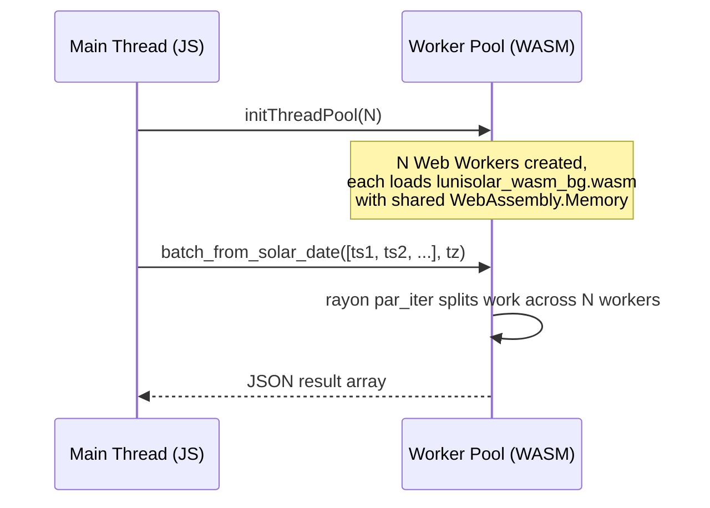

# WASM Specification — Lunisolar-TS

> Repackage the lunisolar calendar calculations as a single WebAssembly module that can be dropped into a web app's `/public` directory for client-side, offline, multi-threaded computation.

---

## 1. Goals

| Goal | Description |
|------|-------------|
| **Single-file deployment** | Produce one `.wasm` file (+ thin JS loader) that a web app places in `/public`. No CDN round-trips, no Node.js, no server-side code required. |
| **Offline operation** | All pre-computed astronomical data (new moons, solar terms, 1900–2100) is embedded at compile time. The module works without any network access. |
| **Multi-threaded performance** | Leverage WebAssembly threads, `SharedArrayBuffer`, and Web Workers so batch calculations (e.g. an entire month of auspicious days) use multiple CPU cores. |
| **API parity** | Expose the same public surface as the current TypeScript package: `fromSolarDate`, `ConstructionStars.calculateMonth`, `GreatYellowPath.getSpirit`. |
| **Small footprint** | Target ≤ 2 MB gzipped for the `.wasm` binary including all embedded data (~2.4 MB raw JSON compresses well inside WASM linear memory). |

---

## 2. Current Architecture (Reference)

The system today is a two-stage pipeline (see `ARCHITECTURE.md`):

```
Python Pipeline ──► JSON files (by year) ──► TypeScript Package (runtime fetch/import)
```

### Data assets

| Directory | Content | Year range | Raw size |
|-----------|---------|------------|----------|
| `output/json/new_moons/` | Array of Unix timestamps (seconds) per year | 1900–2100 | ~120 KB |
| `output/json/solar_terms/` | Array of `[timestamp, termIndex]` pairs per year | 1900–2100 | ~600 KB |
| `output/json/full_moons/` | Array of Unix timestamps per year | 1900–2100 | ~120 KB |

### TypeScript calculations (to be ported)

| Module | Function | Complexity |
|--------|----------|------------|
| `LunisolarCalendar.fromSolarDate` | Gregorian → lunisolar conversion (month periods, leap-month rule, sexagenary cycles) | Medium |
| `ConstructionStars.calculateMonth` | 12 Construction Stars with solar-term-day repeat rule | Low |
| `GreatYellowPath.getSpirit` | Azure Dragon rotation by lunar month | Low |
| `TimezoneHandler` | IANA → UTC offset conversion (Intl-based) | Low |

All calculations are deterministic, CPU-bound, and operate on integer/date arithmetic — ideal for WASM.

---

## 3. Approach Evaluation

### Option A — Rust + `wasm-pack` (Recommended)

| Aspect | Details |
|--------|---------|
| Language | Rust (reimplement ~350 LOC of TS logic) |
| Toolchain | `wasm-pack`, `wasm-bindgen`, `serde`, `serde_json` |
| Data embedding | `include_str!()` / `include_bytes!()` at compile time; parsed once on `init()` |
| Threading | `wasm-bindgen-rayon` — adapts Rayon's `par_iter` to Web Workers + `SharedArrayBuffer` |
| Output | `pkg/` directory containing `.wasm`, JS glue, TypeScript `.d.ts` |
| Pros | Near-native speed, zero-cost abstractions, mature WASM ecosystem, small binaries |
| Cons | Requires Rust nightly for WASM threads; team must learn Rust |

### Option B — AssemblyScript

| Aspect | Details |
|--------|---------|
| Language | AssemblyScript (TypeScript-like subset) |
| Toolchain | `asc` compiler, npm package |
| Data embedding | Import JSON as static arrays in AS source |
| Threading | No built-in threading story; manual Web Worker sharding needed |
| Pros | Familiar syntax for TS developers; fast ramp-up |
| Cons | Weaker optimiser vs Rust; no rayon-like parallelism; smaller ecosystem |

### Recommendation

**Option A (Rust)** is recommended. The calculation logic is small (~350 LOC) and straightforward integer/date math. Rust's `wasm-bindgen-rayon` provides turnkey multi-threading that would require significant manual effort in AssemblyScript. The resulting binary will be smaller and faster.

---

## 4. Architecture

### 4.1 Component Diagram

```mermaid
graph LR
    subgraph Build Time
        JSON[output/json/**/*.json] -->|include_bytes!| RUST[Rust Crate<br/>lunisolar-wasm]
        RUST -->|wasm-pack build| WASM[lunisolar_wasm_bg.wasm<br/>+ lunisolar_wasm.js<br/>+ lunisolar_wasm.d.ts]
    end

    subgraph Runtime · Browser
        APP[Web App] -->|"import init, { ... }"| LOADER[JS Glue<br/>lunisolar_wasm.js]
        LOADER -->|WebAssembly.instantiate| WASM_RT[WASM Instance]
        WASM_RT -->|SharedArrayBuffer| WORKERS[Web Worker Pool<br/>via wasm-bindgen-rayon]
    end
```

### 4.2 Crate Layout

```
wasm/
├── Cargo.toml
├── rust-toolchain.toml          # pin nightly for WASM threads
├── src/
│   ├── lib.rs                   # wasm-bindgen entry points
│   ├── data.rs                  # embedded data (include_str!, lazy parse)
│   ├── calendar.rs              # LunisolarCalendar logic
│   ├── sexagenary.rs            # Gan-Zhi cycle calculations
│   ├── construction_stars.rs    # 12 Construction Stars
│   ├── great_yellow_path.rs     # Great Yellow Path spirits
│   └── timezone.rs              # CST offset helper (fixed +8:00)
├── data/                        # symlink → ../../output/json
│   ├── new_moons/
│   └── solar_terms/
└── tests/
    └── integration.rs           # parity tests vs TypeScript outputs
```

### 4.3 Data Embedding Strategy

```rust
// data.rs — compile-time embedding
use std::sync::OnceLock;
use serde::Deserialize;

#[derive(Deserialize)]
struct YearData {
    new_moons: Vec<i64>,       // Unix timestamps (seconds)
    solar_terms: Vec<(i64, u8)>, // (timestamp, term_index)
}

// Each year file is included as a static string at compile time.
// A build script (build.rs) generates a match arm per year.
static DATA: OnceLock<HashMap<u16, YearData>> = OnceLock::new();

pub fn get_data() -> &'static HashMap<u16, YearData> {
    DATA.get_or_init(|| {
        let mut map = HashMap::new();
        // build.rs generates: include_year!(1900); include_year!(1901); ...
        // Each expands to:
        //   map.insert(1900, serde_json::from_str(include_str!("../data/new_moons/1900.json")).unwrap());
        // Combined new_moons + solar_terms per year in a single struct.
        init_all_years(&mut map);
        map
    })
}
```

The `build.rs` script reads the `data/` directory at compile time and generates the `init_all_years` function with one `include_str!` per JSON file (201 years × 2 data types = 402 includes). Total uncompressed data is ~2.4 MB; inside WASM linear memory this compresses to ~400–600 KB in the `.wasm` binary.

### 4.4 Public API (wasm-bindgen Exports)

```rust
// lib.rs
use wasm_bindgen::prelude::*;
use serde::Serialize;

#[wasm_bindgen]
pub struct LunisolarDate {
    pub lunar_year: i32,
    pub lunar_month: u8,
    pub lunar_day: u8,
    pub is_leap_month: bool,
    // Sexagenary cycle fields
    pub year_stem: String,
    pub year_branch: String,
    pub month_stem: String,
    pub month_branch: String,
    pub day_stem: String,
    pub day_branch: String,
    pub hour_stem: String,
    pub hour_branch: String,
}

/// Convert a Gregorian date to a lunisolar date.
/// `unix_ms` — milliseconds since epoch (from JS `Date.getTime()`).
/// `tz_offset_minutes` — UTC offset in minutes (e.g. +480 for Asia/Shanghai).
#[wasm_bindgen]
pub fn from_solar_date(unix_ms: f64, tz_offset_minutes: i16) -> LunisolarDate { .. }

/// Calculate Construction Stars for an entire Gregorian month.
/// Returns a JSON string of `[{ day, star_name, score, auspicious }]`.
#[wasm_bindgen]
pub fn calculate_month_stars(year: u16, month: u8, tz_offset_minutes: i16) -> String { .. }

/// Get the Great Yellow Path spirit for a single date.
#[wasm_bindgen]
pub fn get_spirit(unix_ms: f64, tz_offset_minutes: i16) -> String { .. }

/// Initialize the thread pool (must call before parallel APIs).
/// `num_threads` — pass `navigator.hardwareConcurrency` from JS.
#[wasm_bindgen]
pub fn init_thread_pool(num_threads: usize) -> js_sys::Promise { .. }

/// Batch-convert multiple dates in parallel (uses rayon par_iter).
/// `unix_ms_array` — Float64Array of timestamps.
/// Returns JSON array of LunisolarDate objects.
#[wasm_bindgen]
pub fn batch_from_solar_date(unix_ms_array: &[f64], tz_offset_minutes: i16) -> String { .. }
```

### 4.5 JavaScript Integration API

```typescript
// lunisolar-wasm-loader.ts — thin wrapper for web apps
import init, {
  initThreadPool,
  from_solar_date,
  calculate_month_stars,
  get_spirit,
  batch_from_solar_date,
} from '/lunisolar_wasm.js';

export async function initLunisolar(): Promise<void> {
  await init();   // loads and compiles the .wasm file
  await initThreadPool(navigator.hardwareConcurrency);
}

export { from_solar_date, calculate_month_stars, get_spirit, batch_from_solar_date };
```

**Consumer usage (React / Vue / Svelte):**

```typescript
import { initLunisolar, from_solar_date } from './lunisolar-wasm-loader';

// Call once at app startup
await initLunisolar();

// Convert a date (synchronous after init)
const result = from_solar_date(Date.now(), 480); // +8:00 CST
console.log(result.lunar_year, result.year_stem + result.year_branch);
```

---

## 5. Threading Model

### 5.1 Overview



### 5.2 Dependencies

- **`wasm-bindgen-rayon`** — adapts Rayon's thread pool to Web Workers with `SharedArrayBuffer`.
- Requires Rust **nightly** toolchain (tracked in `rust-toolchain.toml`).
- RUSTFLAGS: `-C target-feature=+atomics,+bulk-memory,+mutable-globals`

### 5.3 Browser Requirements

Multi-threaded WASM requires the page to be **cross-origin isolated**. The web server must send:

```
Cross-Origin-Opener-Policy: same-origin
Cross-Origin-Embedder-Policy: require-corp
```

| Browser | Threads support | Notes |
|---------|----------------|-------|
| Chrome 91+ | ✅ | Stable since 2021 |
| Firefox 79+ | ✅ | Stable since 2020 |
| Safari 16.4+ | ✅ | Since macOS Ventura / iOS 16.4 |
| Edge 91+ | ✅ | Chromium-based, same as Chrome |

### 5.4 Graceful Degradation

If `SharedArrayBuffer` is unavailable (missing COOP/COEP headers or older browser), the module falls back to **single-threaded** execution. The `initThreadPool` call becomes a no-op, and all `par_iter` calls degrade to sequential `iter`.

```rust
#[wasm_bindgen]
pub fn init_thread_pool(num_threads: usize) -> js_sys::Promise {
    #[cfg(feature = "parallel")]
    {
        wasm_bindgen_rayon::init_thread_pool(num_threads)
    }
    #[cfg(not(feature = "parallel"))]
    {
        let _ = num_threads;
        js_sys::Promise::resolve(&JsValue::UNDEFINED)
    }
}
```

A feature flag `parallel` controls whether `wasm-bindgen-rayon` is compiled in. The build can produce both variants:

```bash
# Multi-threaded build (default)
wasm-pack build --target web -- --features parallel

# Single-threaded build (fallback / simpler deployment)
wasm-pack build --target web
```

---

## 6. Build Pipeline

### 6.1 Prerequisites

```bash
# Rust nightly with WASM target
rustup toolchain install nightly
rustup target add wasm32-unknown-unknown --toolchain nightly

# wasm-pack
cargo install wasm-pack

# wasm-opt (optional, for size optimisation)
cargo install wasm-opt     # or install binaryen
```

### 6.2 Build Commands

```bash
cd wasm/

# Full build (multi-threaded, release, optimised)
RUSTFLAGS='-C target-feature=+atomics,+bulk-memory,+mutable-globals' \
  wasm-pack build --target web --release -- --features parallel

# Post-process: strip debug info, optimise size
wasm-opt -Oz -o pkg/lunisolar_wasm_bg.wasm pkg/lunisolar_wasm_bg.wasm
```

### 6.3 Output Artifacts

```
wasm/pkg/
├── lunisolar_wasm_bg.wasm       # Main WASM binary (~1.5–2 MB)
├── lunisolar_wasm_bg.wasm.d.ts  # TS types for raw WASM bindings
├── lunisolar_wasm.js            # JS glue (init, thread pool bootstrap)
├── lunisolar_wasm.d.ts          # TS types for public API
├── snippets/                    # Worker bootstrap snippets (for rayon)
└── package.json                 # npm-compatible if publishing
```

### 6.4 Deployment to a Web App

Copy the build output into the web app's `/public` directory:

```bash
cp wasm/pkg/lunisolar_wasm_bg.wasm  my-app/public/
cp wasm/pkg/lunisolar_wasm.js       my-app/public/
cp -r wasm/pkg/snippets/            my-app/public/snippets/
```

For frameworks that use a bundler (Vite, Next.js, etc.), place the files in the static/public directory so they are served as-is without being processed by the bundler.

---

## 7. Cargo.toml

```toml
[package]
name = "lunisolar-wasm"
version = "0.1.0"
edition = "2021"

[lib]
crate-type = ["cdylib"]

[dependencies]
wasm-bindgen = "0.2"
serde = { version = "1", features = ["derive"] }
serde_json = "1"
js-sys = "0.3"

[dependencies.rayon]
version = "1"
optional = true

[dependencies.wasm-bindgen-rayon]
version = "1"
optional = true

[features]
default = []
parallel = ["rayon", "wasm-bindgen-rayon"]

[profile.release]
opt-level = "z"      # optimise for size
lto = true
codegen-units = 1
strip = "symbols"
```

---

## 8. Timezone Handling

The current TypeScript package uses the browser's `Intl.DateTimeFormat` API for full IANA timezone support. In WASM, `Intl` is not directly accessible.

### Strategy

1. **For CST-only use (most common):** Hard-code `+08:00` offset inside WASM. All lunisolar calendar boundaries use CST (China Standard Time) as the reference.
2. **For arbitrary timezones:** Accept a `tz_offset_minutes` parameter from JavaScript. The JS caller resolves the IANA timezone to a UTC offset before calling WASM functions. This keeps the WASM module dependency-free and still supports any timezone.

```javascript
// JS side: resolve timezone offset
function getOffsetMinutes(date, iana) {
  const utc = Date.UTC(date.getFullYear(), date.getMonth(), date.getDate());
  const local = new Date(new Intl.DateTimeFormat('en-US', {
    timeZone: iana, year: 'numeric', month: 'numeric', day: 'numeric',
    hour: 'numeric', minute: 'numeric', second: 'numeric', hour12: false
  }).format(date));
  return (local.getTime() - utc) / 60000;
}
```

---

## 9. Testing Strategy

### 9.1 Parity Tests

Generate a golden dataset from the existing TypeScript package for a set of reference dates, then assert that the Rust WASM module produces identical results.

```
Reference dates (minimum set):
- 2025-01-29 (Chinese New Year, Year of the Snake)
- 2025-02-15 (mid-month, leap month edge case test)
- 2023-03-22 (leap month 2 in 2023)
- 1900-01-31 (earliest supported date)
- 2100-12-31 (latest supported date)
- 2024-02-10 (Chinese New Year 2024)
- Each hour boundary for sexagenary hour tests (23:00 Zi hour rule)
```

### 9.2 Rust Unit Tests

```bash
cd wasm/
cargo test                       # native tests (no WASM)
wasm-pack test --headless --chrome  # browser-based WASM tests
```

### 9.3 Browser Integration Tests

Use Playwright or similar to:
1. Serve the WASM module from a local server with COOP/COEP headers.
2. Load the module, call each API function, and assert outputs.
3. Verify thread pool initialization and parallel batch processing.

---

## 10. Performance Targets

| Operation | Single-threaded target | Multi-threaded target (4 cores) |
|-----------|----------------------|-------------------------------|
| `from_solar_date` (single) | < 0.1 ms | N/A (overhead not worth it) |
| `calculate_month_stars` (31 days) | < 5 ms | < 2 ms |
| `batch_from_solar_date` (365 days) | < 30 ms | < 10 ms |
| Module init + data parse | < 50 ms | < 50 ms |

---

## 11. Migration Path

### Phase 1 — Standalone WASM module (this spec)
- Build `lunisolar-wasm` crate alongside the existing `pkg/` TypeScript package.
- Both can coexist: apps choose WASM for offline/performance, TS for server/Node/CDN.

### Phase 2 — Unified package (future)
- Publish `lunisolar-wasm` as an npm package with the `.wasm` file bundled.
- Add a `configure({ strategy: 'wasm' })` option to the existing TypeScript package that delegates to the WASM module instead of using the JS implementation.

### Phase 3 — WASM-first (future)
- Consider making WASM the primary implementation and using the JS glue as the sole public API.
- Deprecate the pure-TypeScript calculation path (data loading + runtime math).

---

## 12. Risks and Mitigations

| Risk | Impact | Mitigation |
|------|--------|------------|
| COOP/COEP headers not set by hosting provider | Multi-threading fails | Graceful fallback to single-threaded; document header requirements |
| Rust nightly required for WASM threads | Build reproducibility | Pin exact nightly in `rust-toolchain.toml`; consider stable once `target-feature` stabilises |
| Large `.wasm` binary size (embedded data) | Slower initial load | `wasm-opt -Oz`, gzip/brotli on server, lazy init via streaming compilation (`WebAssembly.instantiateStreaming`) |
| IANA timezone resolution moved to JS | Slight API difference | Provide a thin JS wrapper that matches the current TS API signature |
| Maintenance of two implementations (TS + Rust) | Code drift | Shared golden test suite; CI runs parity checks on every commit |

---

## 13. References

### WebAssembly & Rust

- [MDN: Compiling Rust to WebAssembly](https://developer.mozilla.org/en-US/docs/WebAssembly/Guides/Rust_to_Wasm)
- [Rust and WebAssembly Book](https://rustwasm.github.io/docs/book/)
- [wasm-pack documentation](https://rustwasm.github.io/docs/wasm-pack/)
- [wasm-bindgen guide](https://rustwasm.github.io/docs/wasm-bindgen/)

### Multi-Threading in WASM

- [web.dev: WebAssembly Threads](https://web.dev/articles/webassembly-threads)
- [wasm-bindgen-rayon (GitHub)](https://github.com/RReverser/wasm-bindgen-rayon)
- [wasm-bindgen-rayon (docs.rs)](https://docs.rs/wasm-bindgen-rayon)
- [Parallel Raytracing example — wasm-bindgen guide](https://rustwasm.github.io/docs/wasm-bindgen/examples/raytrace.html)

### Cross-Origin Isolation (COOP/COEP)

- [web.dev: Making your website cross-origin isolated](https://web.dev/articles/coop-coep)
- [MDN: SharedArrayBuffer](https://developer.mozilla.org/en-US/docs/Web/JavaScript/Reference/Global_Objects/SharedArrayBuffer)

### Data Embedding & Deployment

- [Embedding static data in WASM (include_str!, include_bytes!)](https://doc.rust-lang.org/std/macro.include_str.html)
- [Deploying WASM and data files with your app](https://www.scichart.com/documentation/js/v4/Deploying%20Wasm%20or%20WebAssembly%20and%20Data%20Files%20with%20your%20app.html)
- [Hardcoding large WASM data without memory spikes](https://www.xjavascript.com/blog/hardcoding-large-amounts-of-data-without-inducing-memory-spike/)

### Alternative Approaches

- [AssemblyScript (TypeScript-like → WASM)](https://www.assemblyscript.org/)
- [WASI and the Component Model (2025 status)](https://eunomia.dev/blog/2025/02/16/wasi-and-the-webassembly-component-model-current-status/)
- [The State of WebAssembly 2024–2025](https://platform.uno/blog/state-of-webassembly-2024-2025/)

### Astronomical Calculation Libraries (Prior Art)

- [swisseph-wasm — Swiss Ephemeris in WASM](https://github.com/prolaxu/swisseph-wasm)
- [astro-sweph — High precision Swiss Ephemeris](https://github.com/astroahava/astro-sweph)
