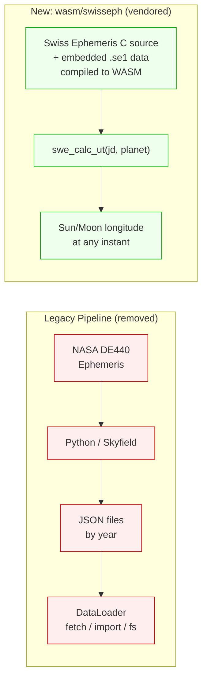
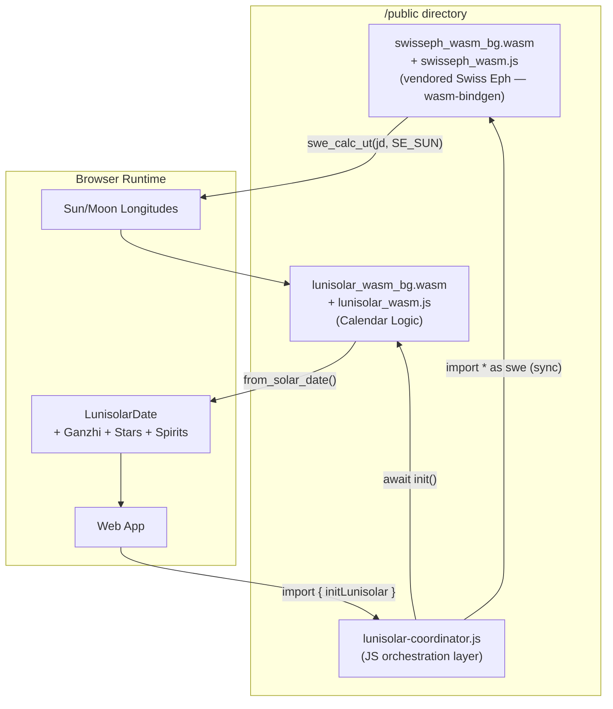
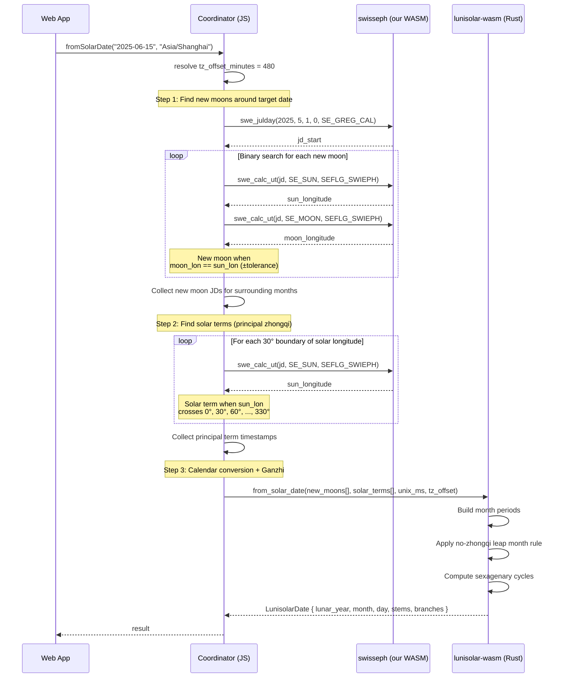
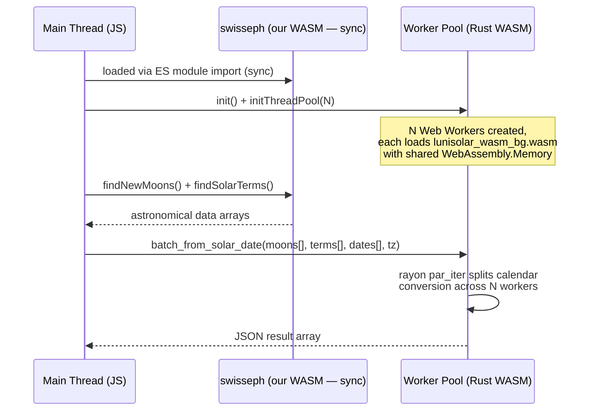

# WASM Specification — Lunisolar-TS

> Replace the legacy Python → JSON → DataLoader pipeline with real-time astronomical calculations using our vendored Swiss Ephemeris WASM module. The ephemeris engine is the Swiss Ephemeris C source (v2.10.03) compiled to WebAssembly via Rust + wasm-bindgen and lives at `wasm/swisseph/`. A second Rust WASM module handles lunisolar calendar logic. Both modules deploy as a self-contained set of files in a web app's `/public` directory for client-side, offline, multi-threaded computation.

---

## 1. Goals

| Goal | Description |
|------|-------------|
| **Eliminate the data pipeline** | Replace the Python pre-computation step and static JSON data files with on-demand planetary position calculations via our vendored swisseph WASM. No more `output/json/`, no CDN, no `DataLoader`. |
| **Single deployment** | Ship a small set of files (vendored swisseph WASM + calendar logic WASM + JS glue) into `/public`. No server-side code required. |
| **Offline operation** | The vendored swisseph WASM embeds its own ephemeris data inside the WASM binary. The module works without any network access. |
| **Multi-threaded performance** | Leverage WebAssembly threads, `SharedArrayBuffer`, and Web Workers so batch calculations (e.g. an entire month of auspicious days) use multiple CPU cores. |
| **API parity** | Expose the same public surface as the current TypeScript package: `fromSolarDate`, `ConstructionStars.calculateMonth`, `GreatYellowPath.getSpirit`. |

---

## 2. Why our vendored swisseph WASM

We compile the Swiss Ephemeris C library directly to WebAssembly using the Rust `cc` crate and wasm-bindgen, vendoring the C source at `wasm/swisseph/`. This replaces any dependency on external npm packages for ephemeris calculations.

- **High precision** — uses the full Swiss Ephemeris with embedded `.se1` data files (same precision as Emscripten-based alternatives).
- **Self-contained** — the WASM binary embeds the ephemeris data; zero network dependencies at runtime.
- **Cross-platform** — works in browsers (Chrome 61+, Firefox 60+, Safari 11+, Edge 16+) and Node.js.
- **Typed API via wasm-bindgen** — `swe_calc_ut()`, `swe_julday()`, `swe_revjul()`, `swe_get_planet_name()` with full TypeScript types.
- **Synchronous init** — standard ES module import; no async `initSwissEph()` call required.
- **Fastest initialization** — 13 ms vs ~38–41 ms for Emscripten-based alternatives (see benchmark at `tests/swisseph-wasm/benchmark.mjs`).

See [`@specs/rust-swisseph-evaluation.md`](./rust-swisseph-evaluation.md) for the full evaluation and benchmark data.

### Key Functions for Lunisolar Calculations

| Swiss Ephemeris function | Purpose in lunisolar context |
|--------------------------|------------------------------|
| `swe_calc_ut(jd, SE_SUN, SEFLG_SWIEPH)` | Sun ecliptic longitude → derive solar terms (every 15° of solar longitude) |
| `swe_calc_ut(jd, SE_MOON, SEFLG_SWIEPH)` | Moon ecliptic longitude → detect new/full moons (Sun–Moon angle 0°/180°) |
| `swe_julday(y, m, d, h, gregflag)` | Gregorian → Julian Day Number |
| `swe_revjul(jd, gregflag)` | Julian Day → Gregorian date components |

### How It Replaces the Python Pipeline



Instead of pre-computing moon phases and solar terms for 201 years and shipping ~2.4 MB of JSON, we call our vendored swisseph WASM at runtime to calculate the exact Sun and Moon longitudes for any date on demand.

---

## 3. Integration Strategy: Build Our Own

### Option A — Integrate as a JS-level Dependency ~~(Recommended)~~ (Not chosen)

| Aspect | Details |
|--------|---------|
| Method | `npm install swisseph-wasm`; import and call from the JS coordination layer |
| WASM modules | Two: `swisseph.wasm` (ephemeris engine) + `lunisolar_wasm_bg.wasm` (calendar logic) |
| Separation | Clear boundary — swisseph-wasm owns ephemeris; Rust WASM owns calendar/Ganzhi/huangdao |
| Upstream updates | Free via `npm update`; bug fixes and ephemeris improvements come automatically |
| Maintenance | Low — only maintain the lunisolar calendar logic and the thin JS coordination layer |

### Option B — Build Our Own Vendored WASM ✅ (Chosen)

| Aspect | Details |
|--------|---------|
| Method | Vendor Swiss Ephemeris C source in `wasm/swisseph/`; compile via Rust `cc` crate + wasm-pack |
| WASM modules | Two: `wasm/swisseph/pkg/` (ephemeris engine) + `wasm/pkg/` (calendar logic) — both wasm-bindgen |
| Separation | Same clear boundary — our ephemeris WASM owns calculations; Rust WASM owns calendar logic |
| Upstream updates | Manual — update vendored C source from `aloistr/swisseph`; CI workflow checks weekly for new tags |
| Maintenance | We own the full build pipeline; no external npm runtime dependency |

### Why we chose Option B

1. **Synchronous init** — our build loads as a standard ES module; no `await initSwissEph()` required. Init is 13 ms vs 38–41 ms for the Emscripten-based npm package.
2. **Typed wasm-bindgen API** — consistent with the calendar logic WASM; no Emscripten Module boilerplate.
3. **Full control** — we embed our own `.se1` ephemeris data, can patch the SE version, and are not subject to upstream npm API changes.
4. **No Emscripten SDK in CI** — wasm-pack + rustup are sufficient; the build is reproducible and fast.
5. **Smaller toolchain** — `wasm-pack` is ~5 MB; Emscripten SDK is ~1 GB.

See [`@specs/rust-swisseph-evaluation.md`](./rust-swisseph-evaluation.md) §6 for a detailed comparison of wasm-bindgen vs Emscripten.

---

## 4. Architecture

### 4.1 System Overview



### 4.2 Data Flow: Calculating a Lunisolar Date



### 4.3 Ephemeris Calculation: Finding New Moons

The key insight: a **new moon** occurs when the Sun and Moon have the same ecliptic longitude. We find this by iterating with binary search:

```javascript
// coordinator: find_new_moon.js
async function findNewMoon(swe, jdStart) {
  // Average synodic month ≈ 29.53059 days
  const SYNODIC = 29.53059;
  let jd = jdStart;

  // Coarse search: step by 1 day until Sun–Moon angle crosses 0°
  // 35 iterations covers more than one synodic month (~29.53 days)
  let prevDiff = sunMoonDiff(swe, jd);
  for (let i = 0; i < 35; i++) {
    jd += 1.0;
    const diff = sunMoonDiff(swe, jd);
    if (prevDiff > 180 && diff < 180) {
      // Crossed 360°→0° boundary — new moon is between jd-1 and jd
      return bisectNewMoon(swe, jd - 1, jd);
    }
    prevDiff = diff;
  }
  return null;
}

function sunMoonDiff(swe, jd) {
  // wasm-bindgen exports SE_SUN, SE_MOON, SEFLG_SWIEPH as functions returning i32 constants.
  // swe_calc_ut(jd, body, iflag) returns a Float64Array([lon, lat, dist, ...]).
  const sunPos = swe.swe_calc_ut(jd, swe.SE_SUN(), swe.SEFLG_SWIEPH());
  const moonPos = swe.swe_calc_ut(jd, swe.SE_MOON(), swe.SEFLG_SWIEPH());
  let diff = moonPos[0] - sunPos[0];
  if (diff < 0) diff += 360;
  return diff;
}

function bisectNewMoon(swe, jdLo, jdHi) {
  // 30 bisection iterations on a ~1 day interval → precision of ~0.08 seconds
  for (let i = 0; i < 30; i++) {
    const jdMid = (jdLo + jdHi) / 2;
    const diff = sunMoonDiff(swe, jdMid);
    if (diff > 180) jdLo = jdMid;  // before conjunction
    else jdHi = jdMid;              // after conjunction
  }
  return (jdLo + jdHi) / 2;
}
```

### 4.4 Ephemeris Calculation: Finding Solar Terms

A **solar term** occurs every time the Sun's ecliptic longitude crosses a multiple of 15°. The 24 solar terms divide the ecliptic into 24 equal segments. **Principal terms** (中氣 zhōngqì) are at multiples of 30°.

```javascript
// coordinator: find_solar_terms.js
async function findSolarTerms(swe, year) {
  const terms = [];
  // SE_GREG_CAL = 1 (wasm-bindgen exports this as a function returning an i32 constant)
  const SE_GREG_CAL = swe.SE_GREG_CAL();
  // Start from winter solstice of previous year (sun_lon ≈ 270°)
  let jd = swe.swe_julday(year - 1, 12, 15, 0, SE_GREG_CAL);

  for (let targetDeg = 270; terms.length < 30; targetDeg = (targetDeg + 15) % 360) {
    jd = bisectSolarLongitude(swe, jd, targetDeg);
    const termIndex = Math.round(targetDeg / 15); // 0..23
    const isPrincipal = (targetDeg % 30 === 0);
    const date = swe.swe_revjul(jd, SE_GREG_CAL);
    terms.push({ jd, termIndex, isPrincipal, date });
    jd += 14; // advance ~half a term for next search
  }
  return terms;
}

function bisectSolarLongitude(swe, jdStart, targetDeg) {
  // Find when sun longitude crosses targetDeg
  let jdLo = jdStart;
  let jdHi = jdStart + 40; // max ~40 days between successive solar terms

  // 50 bisection iterations on a ~40 day interval → sub-millisecond precision
  for (let i = 0; i < 50; i++) {
    const jdMid = (jdLo + jdHi) / 2;
    const sunPos = swe.swe_calc_ut(jdMid, swe.SE_SUN(), swe.SEFLG_SWIEPH());
    const sunLon = sunPos[0];

    // Handle 360°→0° wraparound
    let diff = sunLon - targetDeg;
    if (diff > 180) diff -= 360;
    if (diff < -180) diff += 360;

    if (diff < 0) jdLo = jdMid;
    else jdHi = jdMid;
  }
  return (jdLo + jdHi) / 2;
}
```

### 4.5 Crate Layout (Rust WASM — Calendar Logic)

The Rust WASM module handles the lunisolar calendar conversion and auspicious day calculations. It receives pre-computed new moon and solar term data from the JS coordinator.

```
wasm/
├── Cargo.toml
├── rust-toolchain.toml          # pin nightly for WASM threads
├── src/
│   ├── lib.rs                   # wasm-bindgen entry points
│   ├── calendar.rs              # LunisolarCalendar logic (month periods, leap month)
│   ├── sexagenary.rs            # Gan-Zhi cycle calculations (year/month/day/hour)
│   ├── construction_stars.rs    # 12 Construction Stars (十二建星)
│   ├── great_yellow_path.rs     # Great Yellow Path spirits (大黄道)
│   └── timezone.rs              # CST offset helper (fixed +8:00)
└── tests/
    └── integration.rs           # parity tests vs TypeScript outputs
```

Note: no `data/` directory — ephemeris data is no longer embedded. The Rust module receives astronomical events as function parameters from the JS coordinator.

### 4.6 Public API (wasm-bindgen Exports)

```rust
// lib.rs
use wasm_bindgen::prelude::*;

#[wasm_bindgen]
pub struct LunisolarDate {
    pub lunar_year: i32,
    pub lunar_month: u8,
    pub lunar_day: u8,
    pub is_leap_month: bool,
    pub year_stem: String,
    pub year_branch: String,
    pub month_stem: String,
    pub month_branch: String,
    pub day_stem: String,
    pub day_branch: String,
    pub hour_stem: String,
    pub hour_branch: String,
}

/// Convert a Gregorian date to a lunisolar date.
///
/// `new_moon_jds` — Julian Day numbers of new moons (from our vendored swisseph WASM).
/// `principal_term_jds` — Julian Day numbers of principal solar terms.
/// `principal_term_indices` — corresponding term indices (0..11 for Z1..Z12).
/// `target_jd` — Julian Day of the target date.
/// `tz_offset_minutes` — UTC offset in minutes (e.g. +480 for CST).
#[wasm_bindgen]
pub fn from_solar_date(
    new_moon_jds: &[f64],
    principal_term_jds: &[f64],
    principal_term_indices: &[u8],
    target_jd: f64,
    tz_offset_minutes: i16,
) -> LunisolarDate { .. }

/// Calculate Construction Stars for a month.
/// Returns a JSON string of `[{ day, star_name, score, auspicious }]`.
#[wasm_bindgen]
pub fn calculate_month_stars(
    new_moon_jds: &[f64],
    principal_term_jds: &[f64],
    principal_term_indices: &[u8],
    sectional_term_jds: &[f64],
    year: u16,
    month: u8,
    tz_offset_minutes: i16,
) -> String { .. }

/// Get the Great Yellow Path spirit for a single date.
#[wasm_bindgen]
pub fn get_spirit(lunar_month: u8, day_branch_index: u8) -> String { .. }

/// Initialize the thread pool (must call before parallel APIs).
#[wasm_bindgen]
pub fn init_thread_pool(num_threads: usize) -> js_sys::Promise { .. }

/// Batch-convert multiple dates in parallel (uses rayon par_iter).
#[wasm_bindgen]
pub fn batch_from_solar_date(
    new_moon_jds: &[f64],
    principal_term_jds: &[f64],
    principal_term_indices: &[u8],
    target_jds: &[f64],
    tz_offset_minutes: i16,
) -> String { .. }
```

### 4.7 JavaScript Coordinator

The coordinator is the glue layer that wires our vendored `wasm/swisseph/` WASM module and `lunisolar-wasm` together:

```typescript
// lunisolar-coordinator.ts
import * as swe from './swisseph_wasm.js';   // our vendored build (wasm-bindgen, sync init)
import init, {
  init_thread_pool,
  from_solar_date as _from_solar_date,
  calculate_month_stars as _calculate_month_stars,
  get_spirit as _get_spirit,
  batch_from_solar_date as _batch_from_solar_date,
} from './lunisolar_wasm.js';

let initialized = false;

export async function initLunisolar(): Promise<void> {
  // swisseph is a wasm-bindgen module: it is initialized automatically when the
  // ES module is imported (no async initSwissEph() call needed, unlike Emscripten).
  // Only the calendar logic WASM needs an explicit async init().
  await init();

  // Optional: initialize thread pool for batch operations
  if (typeof SharedArrayBuffer !== 'undefined') {
    await init_thread_pool(navigator.hardwareConcurrency);
  }
  initialized = true;
}

export async function fromSolarDate(
  date: Date,
  timezone: string = 'Asia/Shanghai',
): Promise<LunisolarDate> {
  if (!initialized) throw new Error('Call initLunisolar() first');

  const tzOffset = getOffsetMinutes(date, timezone);
  const jd = swe.swe_julday(
    date.getUTCFullYear(),
    date.getUTCMonth() + 1,
    date.getUTCDate(),
    date.getUTCHours() + date.getUTCMinutes() / 60,
    1, // SE_GREG_CAL
  );

  // Gather astronomical data around the target date
  const year = date.getFullYear();
  const newMoonJDs = await findNewMoonsForRange(swe, year);
  const solarTerms = await findSolarTerms(swe, year);

  const principalTerms = solarTerms.filter(t => t.isPrincipal);
  const principalJDs = new Float64Array(principalTerms.map(t => t.jd));
  const principalIndices = new Uint8Array(principalTerms.map(t => t.termIndex));

  // Delegate calendar logic to Rust WASM
  return _from_solar_date(
    new Float64Array(newMoonJDs),
    principalJDs,
    principalIndices,
    jd,
    tzOffset,
  );
}

export async function calculateMonthStars(
  year: number,
  month: number,
  timezone: string = 'Asia/Shanghai',
): Promise<DayInfo[]> {
  if (!initialized) throw new Error('Call initLunisolar() first');

  const tzOffset = getOffsetMinutes(new Date(year, month - 1, 15), timezone);
  const newMoonJDs = await findNewMoonsForRange(swe, year);
  const solarTerms = await findSolarTerms(swe, year);

  const principalTerms = solarTerms.filter(t => t.isPrincipal);
  const sectionalTerms = solarTerms.filter(t => !t.isPrincipal);

  const json = _calculate_month_stars(
    new Float64Array(newMoonJDs),
    new Float64Array(principalTerms.map(t => t.jd)),
    new Uint8Array(principalTerms.map(t => t.termIndex)),
    new Float64Array(sectionalTerms.map(t => t.jd)),
    year,
    month,
    tzOffset,
  );
  return JSON.parse(json);
}
```

**Consumer usage (React / Vue / Svelte):**

```typescript
import { initLunisolar, fromSolarDate, calculateMonthStars, destroy } from './lunisolar-coordinator';

// Call once at app startup
await initLunisolar();

// Convert a date
const result = await fromSolarDate(new Date('2025-06-15'), 'Asia/Shanghai');
console.log(result.lunar_year, result.year_stem + result.year_branch);

// Get auspicious days for a month
const stars = await calculateMonthStars(2025, 6);
const auspicious = stars.filter(d => d.score >= 3);

// Cleanup on unmount
destroy();
```

---

## 5. Threading Model

### 5.1 Overview



### 5.2 Dependencies

- **`wasm-bindgen-rayon`** — adapts Rayon's thread pool to Web Workers with `SharedArrayBuffer`.
- Requires Rust **nightly** toolchain (tracked in `rust-toolchain.toml`).
- RUSTFLAGS: `-C target-feature=+atomics,+bulk-memory,+mutable-globals`

### 5.3 Browser Requirements

Multi-threaded WASM requires the page to be **cross-origin isolated**. The web server must send:

```
Cross-Origin-Opener-Policy: same-origin
Cross-Origin-Embedder-Policy: require-corp
```

| Browser | Threads support | Notes |
|---------|----------------|-------|
| Chrome 91+ | ✅ | Stable since 2021 |
| Firefox 79+ | ✅ | Stable since 2020 |
| Safari 16.4+ | ✅ | Since macOS Ventura / iOS 16.4 |
| Edge 91+ | ✅ | Chromium-based, same as Chrome |

### 5.4 Graceful Degradation

If `SharedArrayBuffer` is unavailable (missing COOP/COEP headers or older browser), the module falls back to **single-threaded** execution. The `initThreadPool` call becomes a no-op, and all `par_iter` calls degrade to sequential `iter`.

```rust
#[wasm_bindgen]
pub fn init_thread_pool(num_threads: usize) -> js_sys::Promise {
    #[cfg(feature = "parallel")]
    {
        wasm_bindgen_rayon::init_thread_pool(num_threads)
    }
    #[cfg(not(feature = "parallel"))]
    {
        let _ = num_threads;
        js_sys::Promise::resolve(&JsValue::UNDEFINED)
    }
}
```

A feature flag `parallel` controls whether `wasm-bindgen-rayon` is compiled in:

```bash
# Multi-threaded build (default)
wasm-pack build --target web -- --features parallel

# Single-threaded build (fallback / simpler deployment)
wasm-pack build --target web
```

---

## 6. Build Pipeline

### 6.1 Prerequisites

```bash
# Rust nightly with WASM target
rustup toolchain install nightly
rustup target add wasm32-unknown-unknown --toolchain nightly

# wasm-pack
cargo install wasm-pack

# wasm-opt (optional, for size optimization — install Binaryen)
# See https://github.com/WebAssembly/binaryen/releases
# e.g. apt install binaryen, brew install binaryen, or download from GitHub
```

### 6.2 Build Commands

```bash
# Build the vendored swisseph WASM (ephemeris engine)
cd wasm/swisseph/
wasm-pack build --target nodejs --release   # or --target web for browser

# Build the Rust calendar logic WASM (multi-threaded, release)
cd wasm/
RUSTFLAGS='-C target-feature=+atomics,+bulk-memory,+mutable-globals' \
  wasm-pack build --target web --release -- --features parallel

# Post-process: optimize size
wasm-opt -Oz -o pkg/lunisolar_wasm_bg.wasm pkg/lunisolar_wasm_bg.wasm
```

### 6.3 Output Artifacts

```
wasm/swisseph/pkg/
├── swisseph_wasm_bg.wasm        # Swiss Ephemeris engine (~2.1 MB; includes .se1 data)
├── swisseph_wasm_bg.wasm.d.ts   # TS types for raw WASM bindings
├── swisseph_wasm.js             # JS glue (wasm-bindgen, ~10 KB)
└── swisseph_wasm.d.ts           # TS types: swe_calc_ut, swe_julday, swe_revjul, ...

wasm/pkg/
├── lunisolar_wasm_bg.wasm       # Calendar logic WASM (~200 KB)
├── lunisolar_wasm_bg.wasm.d.ts  # TS types for raw WASM bindings
├── lunisolar_wasm.js            # JS glue (init, thread pool bootstrap)
├── lunisolar_wasm.d.ts          # TS types for public API
├── snippets/                    # Worker bootstrap snippets (for rayon)
└── package.json                 # npm-compatible if publishing
```

### 6.4 Deployment to a Web App

```bash
# 1. Copy vendored swisseph WASM output (ephemeris engine)
cp wasm/swisseph/pkg/swisseph_wasm_bg.wasm  my-app/public/
cp wasm/swisseph/pkg/swisseph_wasm.js       my-app/public/

# 2. Copy Rust calendar logic WASM output
cp wasm/pkg/lunisolar_wasm_bg.wasm  my-app/public/
cp wasm/pkg/lunisolar_wasm.js       my-app/public/
cp -r wasm/pkg/snippets/            my-app/public/snippets/

# 3. Copy the coordinator
cp lunisolar-coordinator.js  my-app/public/
```

**Resulting `/public` directory:**

```
my-app/public/
├── swisseph_wasm_bg.wasm        # Swiss Ephemeris engine (~2.1 MB, self-contained)
├── swisseph_wasm.js             # wasm-bindgen glue (~10 KB)
├── lunisolar_wasm_bg.wasm       # Rust calendar logic (~200 KB)
├── lunisolar_wasm.js            # Rust WASM JS glue
├── lunisolar-coordinator.js     # Orchestration layer
└── snippets/                    # Rayon worker snippets (if parallel)
```

> **Size note:** Total transfer is ~2.3 MB (~700 KB gzipped). The `swisseph_wasm_bg.wasm` binary embeds the Swiss Ephemeris `.se1` data files directly, so no separate data download is needed.

For frameworks with bundlers (Vite, Next.js), place files in the static/public directory so they are served as-is.

**Vite configuration:**

```javascript
// vite.config.js
export default defineConfig({
  server: { fs: { allow: ['..'] } },
  assetsInclude: ['**/*.wasm'],
});
```

---

## 7. Cargo.toml

```toml
[package]
name = "lunisolar-wasm"
version = "0.1.0"
edition = "2021"

[lib]
crate-type = ["cdylib"]

[dependencies]
wasm-bindgen = "0.2"
serde = { version = "1", features = ["derive"] }
serde_json = "1"
js-sys = "0.3"

[dependencies.rayon]
version = "1"
optional = true

[dependencies.wasm-bindgen-rayon]
version = "1"
optional = true

[features]
default = []
parallel = ["rayon", "wasm-bindgen-rayon"]

[profile.release]
opt-level = "z"      # optimize for size
lto = true
codegen-units = 1
strip = "symbols"
```

Note: `serde` and `serde_json` are still used for serializing results to JSON strings returned to JS. No data files are embedded — the crate is much smaller than the previous spec.

---

## 8. Timezone Handling

The current TypeScript package uses the browser's `Intl.DateTimeFormat` API for full IANA timezone support. In WASM, `Intl` is not directly accessible.

### Strategy

1. **For CST-only use (most common):** Hard-code `+08:00` offset inside WASM. All lunisolar calendar boundaries use CST (China Standard Time) as the reference.
2. **For arbitrary timezones:** Accept a `tz_offset_minutes` parameter from JavaScript. The JS coordinator resolves the IANA timezone to a UTC offset before calling WASM functions.

```javascript
// JS side: resolve timezone offset for a given instant
function getOffsetMinutes(date, iana) {
  const fmt = (tz) => new Intl.DateTimeFormat('en-US', {
    timeZone: tz, year: 'numeric', month: 'numeric', day: 'numeric',
    hour: 'numeric', minute: 'numeric', second: 'numeric', hour12: false
  });
  const toParts = (tz) => {
    const p = Object.fromEntries(
      fmt(tz).formatToParts(date).map(({ type, value }) => [type, Number(value)])
    );
    return Date.UTC(p.year, p.month - 1, p.day, p.hour, p.minute, p.second);
  };
  return (toParts(iana) - toParts('UTC')) / 60000;
}
```

---

## 9. Testing Strategy

### 9.1 Parity Tests

Generate a golden dataset from the existing TypeScript package for a set of reference dates, then assert that the new vendored swisseph WASM + Rust WASM pipeline produces identical results.

```
Reference dates (minimum set):
- 2025-01-29 (Chinese New Year, Year of the Snake)
- 2025-02-15 (mid-month, leap month edge case test)
- 2023-03-22 (leap month 2 in 2023)
- 1900-01-31 (earliest supported date)
- 2100-12-31 (latest supported date)
- 2024-02-10 (Chinese New Year 2024)
- Each hour boundary for sexagenary hour tests (23:00 Zi hour rule)
```

### 9.2 Ephemeris Accuracy Tests

Verify that our vendored swisseph WASM produces moon/sun positions consistent with the pre-computed Python pipeline data:

```javascript
// Compare our swe_calc_ut new moon detection with legacy JSON data
const legacyNewMoons2025 = [1738154158, 1740703489, ...]; // from output/json/new_moons/2025.json
const sweNewMoons2025 = await findNewMoonsForYear(swe, 2025);

for (let i = 0; i < legacyNewMoons2025.length; i++) {
  const legacyJD = legacyNewMoons2025[i] / 86400 + 2440587.5;
  const sweJD = sweNewMoons2025[i];
  assert(Math.abs(legacyJD - sweJD) < 0.001); // within ~86 seconds
}
```

### 9.3 Rust Unit Tests

```bash
cd wasm/
cargo test                       # native tests (no WASM)
wasm-pack test --headless --chrome  # browser-based WASM tests
```

### 9.4 Browser Integration Tests

Use Playwright or similar to:
1. Serve both WASM modules from a local server with COOP/COEP headers.
2. Load the coordinator, call each API function, and assert outputs.
3. Verify thread pool initialization and parallel batch processing.

---

## 10. Performance Targets

| Operation | Single-threaded target | Multi-threaded target (4 cores) |
|-----------|----------------------|-------------------------------|
| `fromSolarDate` (single date) | < 5 ms | N/A (overhead not worth it) |
| `calculateMonthStars` (31 days) | < 50 ms | < 15 ms |
| `batch_from_solar_date` (365 days) | < 500 ms | < 150 ms |
| Module init (both WASM) | < 200 ms | < 200 ms |
| `findNewMoons` (13 moons/year) | < 20 ms | N/A |
| `findSolarTerms` (24 terms/year) | < 30 ms | N/A |

> Note: Performance targets are higher than the previous spec because ephemeris calculations are now done at runtime instead of using pre-computed data. The trade-off is eliminating the Python pipeline and ~2.4 MB of static data.

---

## 11. Migration Path

### Phase 1 — Standalone WASM module (this spec)
- Build `lunisolar-wasm` crate + coordinator alongside the existing `pkg/` TypeScript package.
- Both can coexist: apps choose WASM+swisseph for offline/client-side, TS package for server/Node/CDN.
- Validate parity between the new swisseph-based calculations and legacy pre-computed data.

### Phase 2 — Unified package (future)
- Publish `lunisolar-wasm` + coordinator as an npm package with our vendored swisseph WASM bundled.
- Add a `configure({ strategy: 'wasm' })` option to the existing TypeScript package that delegates to the WASM modules.

### Phase 3 — Deprecate the Python pipeline (future)
- Once the vendored swisseph approach is validated, deprecate `data/main.py` and the JSON output pipeline.
- The Rust WASM + vendored swisseph becomes the primary implementation.
- Keep the TS package as a thin wrapper that either uses the WASM backend or falls back to legacy JSON data.

---

## 12. Risks and Mitigations

| Risk | Impact | Mitigation |
|------|--------|------------|
| COOP/COEP headers not set by hosting provider | Multi-threading fails | Graceful fallback to single-threaded; document header requirements |
| Rust nightly required for WASM threads | Build reproducibility | Pin exact nightly in `rust-toolchain.toml`; consider stable once `target-feature` stabilizes |
| Two WASM modules to load | Slightly longer init | swisseph is sync; calendar logic async; total transfer ~2.3 MB (~700 KB gzipped) |
| Swiss Ephemeris upstream update needed | New SE version not automatically picked up | Scheduled CI workflow (`.github/workflows/check-swisseph-update.yml`) checks `aloistr/swisseph` weekly and opens an issue when a new version is available |
| Runtime ephemeris calculation is slower than pre-computed lookup | Higher per-call latency | Cache computed new moons/solar terms per year in the coordinator; first call ~20 ms, subsequent calls instant |
| IANA timezone resolution in JS | Slight API difference vs current TS package | Thin JS coordinator wraps timezone resolution transparently |

---

## 13. References

### Swiss Ephemeris / Our Vendored Build

- [aloistr/swisseph — Official Swiss Ephemeris (GitHub)](https://github.com/aloistr/swisseph) — C source maintained by Alois Treindl
- [Swiss Ephemeris — Astrodienst](https://www.astro.com/swisseph/) — Original C library, documentation, and commercial licensing
- [wasm/swisseph/ — Our vendored WASM build](../wasm/swisseph/) — Rust `cc` crate + wasm-bindgen wrapping SE v2.10.03
- [`@specs/rust-swisseph-evaluation.md`](./rust-swisseph-evaluation.md) — Crate evaluation, benchmark data, and why wasm-bindgen instead of Emscripten

### WebAssembly & Rust

- [MDN: Compiling Rust to WebAssembly](https://developer.mozilla.org/en-US/docs/WebAssembly/Guides/Rust_to_Wasm)
- [Rust and WebAssembly Book](https://rustwasm.github.io/docs/book/)
- [wasm-pack documentation](https://rustwasm.github.io/docs/wasm-pack/)
- [wasm-bindgen guide](https://rustwasm.github.io/docs/wasm-bindgen/)

### Multi-Threading in WASM

- [web.dev: WebAssembly Threads](https://web.dev/articles/webassembly-threads)
- [wasm-bindgen-rayon (GitHub)](https://github.com/RReverser/wasm-bindgen-rayon)
- [wasm-bindgen-rayon (docs.rs)](https://docs.rs/wasm-bindgen-rayon)
- [Parallel Raytracing example — wasm-bindgen guide](https://rustwasm.github.io/docs/wasm-bindgen/examples/raytrace.html)

### Cross-Origin Isolation (COOP/COEP)

- [web.dev: Making your website cross-origin isolated](https://web.dev/articles/coop-coep)
- [MDN: SharedArrayBuffer](https://developer.mozilla.org/en-US/docs/Web/JavaScript/Reference/Global_Objects/SharedArrayBuffer)
