# Architecture

This document describes the architecture of the **Lunisolar-TS** project — a multi-component system consisting of a **Python data pipeline** for high-precision astronomical calculations, **WebAssembly modules** for calendar conversion (with integrated Swiss Ephemeris), and an **npm package** (`lunisolar-wasm`) for distribution.

---

## System Overview

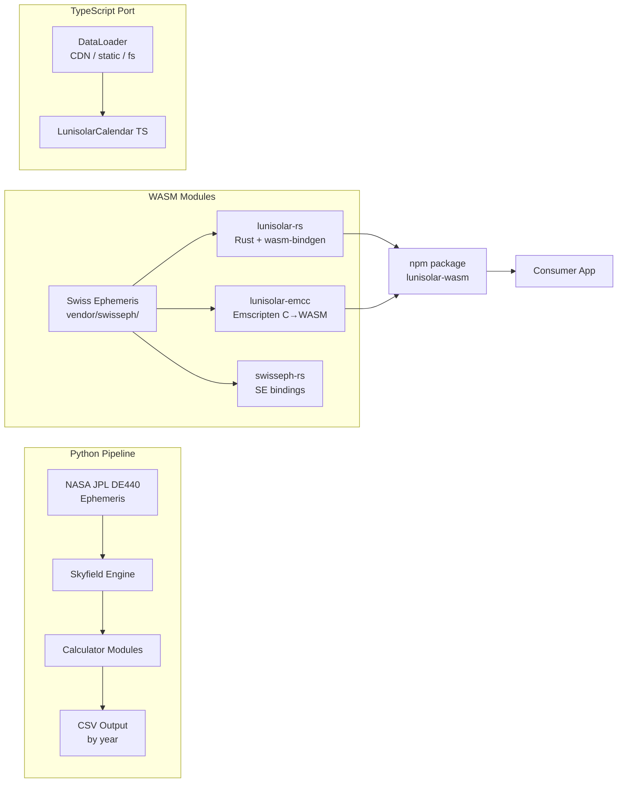

The Python pipeline pre-computes astronomical events (moon phases, solar terms) from NASA ephemeris data and writes them as year-chunked JSON files. The WASM modules use the Swiss Ephemeris (with embedded `.se1` data files) for fully standalone calendar conversion — no pre-computed data required.

---

## Python Data Pipeline

### Module Dependency Graph

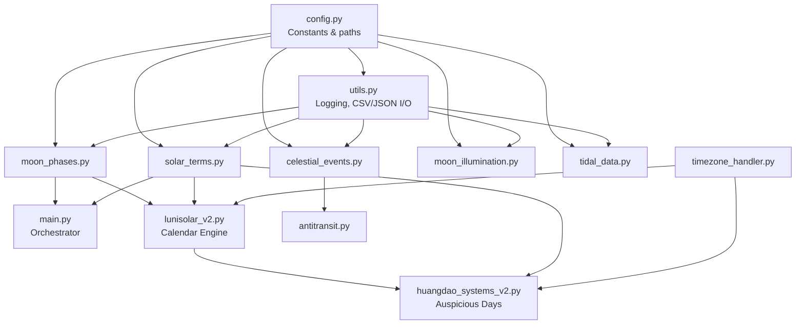

### Orchestrator (`lunisolar-python/main.py`)

The orchestrator coordinates parallel computation and writes year-grouped JSON:

```python
# Parallel task submission (from main.py)
with ProcessPoolExecutor(max_workers=min(NUM_PROCESSES, 2)) as executor:
    futures = {
        executor.submit(calculate_moon_phases, start_time, end_time): "moon_phases",
        executor.submit(calculate_solar_terms, start_time, end_time): "solar_terms",
    }
```

Results are grouped by year and written to a directory tree:

```
output/
├── new_moons/
│   ├── 2024.csv     # unix_timestamp per line
│   └── 2025.csv
├── full_moons/
│   ├── 2024.csv
│   └── 2025.csv
└── solar_terms/
    ├── 2024.csv     # timestamp,index per line
    └── 2025.csv
```

### Calculator Modules

Each module follows a consistent pattern — accept a date range, load the ephemeris, and return structured results:

```python
# Example: moon_phases.py
def calculate_moon_phases(start_time, end_time):
    ts = load.timescale()
    eph = load(EPHEMERIS_FILE)       # nasa/de440.bsp
    t0, t1 = ts.from_datetime(start_time), ts.from_datetime(end_time)
    t, y = almanac.find_discrete(t0, t1, almanac.moon_phases(eph))
    results = []
    for ti, yi in zip(t, y):
        if yi in (0, 2):             # New Moon or Full Moon only
            unix_timestamp = int(ti.utc_datetime().timestamp())
            results.append((unix_timestamp, yi, almanac.MOON_PHASES[yi]))
    return results
```

| Module | Output | Interval |
|--------|--------|----------|
| `moon_phases.py` | New/Full Moon timestamps | Per event |
| `solar_terms.py` | 24 solar term timestamps + indices | Per event |
| `moon_illumination.py` | Illumination percentage | Every 2 hours |
| `celestial_events.py` | Rise/set/transit for Sun, Moon, planets | Per event |
| `tidal_data.py` | Tidal acceleration vectors + lunar mansion | Every 4 minutes |

### Lunisolar Calendar Engine (`lunisolar-python/lunisolar_v2.py`)

The core conversion engine is decomposed into nine service classes, each with a single responsibility:

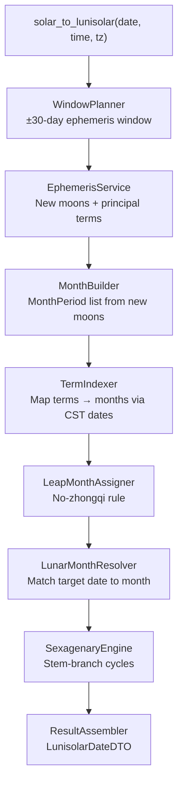

**Key design decisions:**

- **CST date-only comparisons** — month boundaries are compared using CST calendar dates, not UTC instants, matching traditional practice.
- **No-zhongqi rule** — a lunar month that contains no principal solar term (中氣) becomes the leap month.
- **Continuous day count** — the day cycle uses an unbroken count from the reference date 4 AD (Jiazi day), not month-relative offsets.
- **Wu Shu Dun (五鼠遁)** — hour stems are derived from the day stem using the traditional mapping rule.

### Huangdao Systems (`lunisolar-python/huangdao_systems_v2.py`)

Implements two traditional Chinese auspicious day systems:

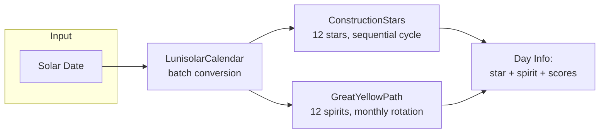

| System | Cycle | Key Rule |
|--------|-------|----------|
| 12 Construction Stars (十二建星) | Sequential 12-day | On solar term days, repeat the previous day's star |
| Great Yellow Path (大黄道) | Monthly spirit rotation | Azure Dragon start position rotates by lunar month |

---

## WebAssembly Modules (`ports/`)

The project has three WASM implementations, all using the vendored Swiss Ephemeris C source (`vendor/swisseph/`) with embedded `.se1` data files for fully standalone operation.

### Package Naming Convention

| Directory | Language | Build Toolchain | Description |
|-----------|----------|-----------------|-------------|
| `ports/lunisolar-rs/` | Rust | wasm-pack / wasm-bindgen | Lunisolar calendar in Rust |
| `ports/lunisolar-emcc/` | C | Emscripten / emcc | Lunisolar calendar in C |
| `ports/swisseph-rs/` | Rust | wasm-pack / wasm-bindgen | Swiss Ephemeris bindings |

### `lunisolar-rs/` — Rust WASM Port

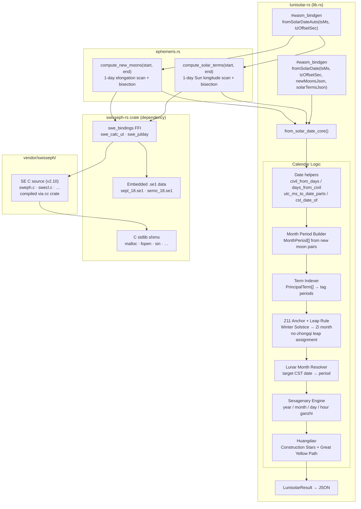

The Rust port depends on `swisseph-rs` as a path dependency:

```toml
[dependencies]
swisseph-wasm = { path = "../swisseph-rs" }
```

Exported JS functions:
- `fromSolarDate(tsMs, tzOffsetSec, newMoonsJson, solarTermsJson)` — accepts pre-computed data (for benchmark compatibility)
- `fromSolarDateAuto(tsMs, tzOffsetSec)` — **standalone**: computes everything internally via Swiss Ephemeris

### `lunisolar-emcc/` — Emscripten C Port

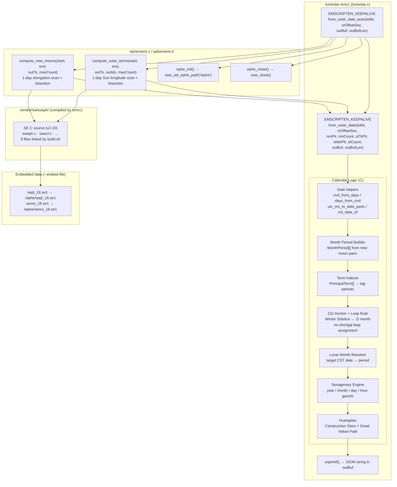

Built by `build.sh`, which compiles the calendar C code plus all 9 SE C files from `vendor/swisseph/` and embeds `.se1` data via `--embed-file`:

```bash
emcc lunisolar.c ephemeris.c "${SWE_SRCS[@]}" \
  -I"$SWE_DIR" \
  --embed-file "$EPHE_DIR/sepl_18.se1@/ephe/sepl_18.se1" \
  --embed-file "$EPHE_DIR/semo_18.se1@/ephe/semo_18.se1" \
  -o "$OUT_DIR/lunisolar_emcc.mjs"
```

Exported C functions:
- `from_solar_date(...)` — accepts pre-computed data via WASM heap pointers
- `from_solar_date_auto(tsMs, tzOffsetSec, outBuf, outBufLen)` — **standalone**: computes everything internally

### `swisseph-rs/` — Swiss Ephemeris Bindings

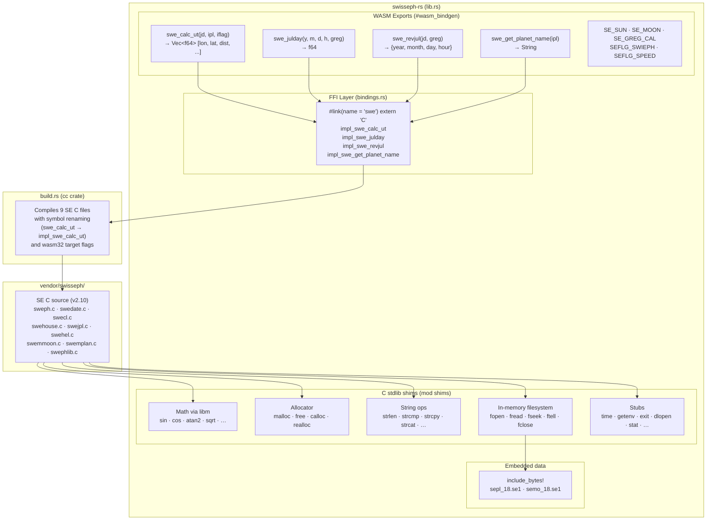

Provides low-level SE function access via Rust FFI with wasm-bindgen:
- Compiles SE C source via `cc` crate (`build.rs`)
- Renames C symbols to avoid collision with wasm-bindgen exports
- Provides in-memory filesystem shims (`fopen`/`fread`/`fseek`) for embedded `.se1` data
- Exports `swe_calc_ut`, `swe_julday`, `swe_revjul`, `swe_get_planet_name` to JS

### npm Package (`pkg/`)

The Emscripten-based `lunisolar-wasm` package is published to npm:

```json
{
  "name": "lunisolar-wasm",
  "main": "lunisolar_emcc.mjs",
  "files": ["lunisolar_emcc.mjs", "lunisolar_emcc.wasm", "README.md"]
}
```

Usage:
```js
import createLunisolarEmcc from 'lunisolar-wasm';
const mod = await createLunisolarEmcc();

const outPtr = mod._malloc(1024);
const n = mod._from_solar_date_auto(Date.now(), 28800, outPtr, 1024);
if (n > 0) console.log(JSON.parse(mod.UTF8ToString(outPtr, n)));
mod._free(outPtr);
```

---

## TypeScript NPM Package (`ports/lunisolar-ts/`)

### Package Structure

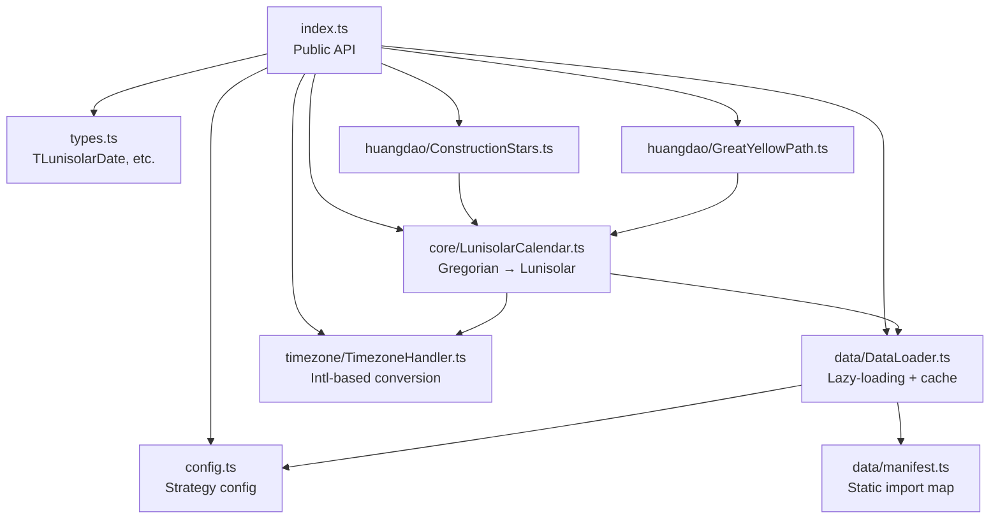

### Data Loading Strategy

The `DataLoader` supports three strategies to work across runtimes (browser, Node.js, serverless edge):

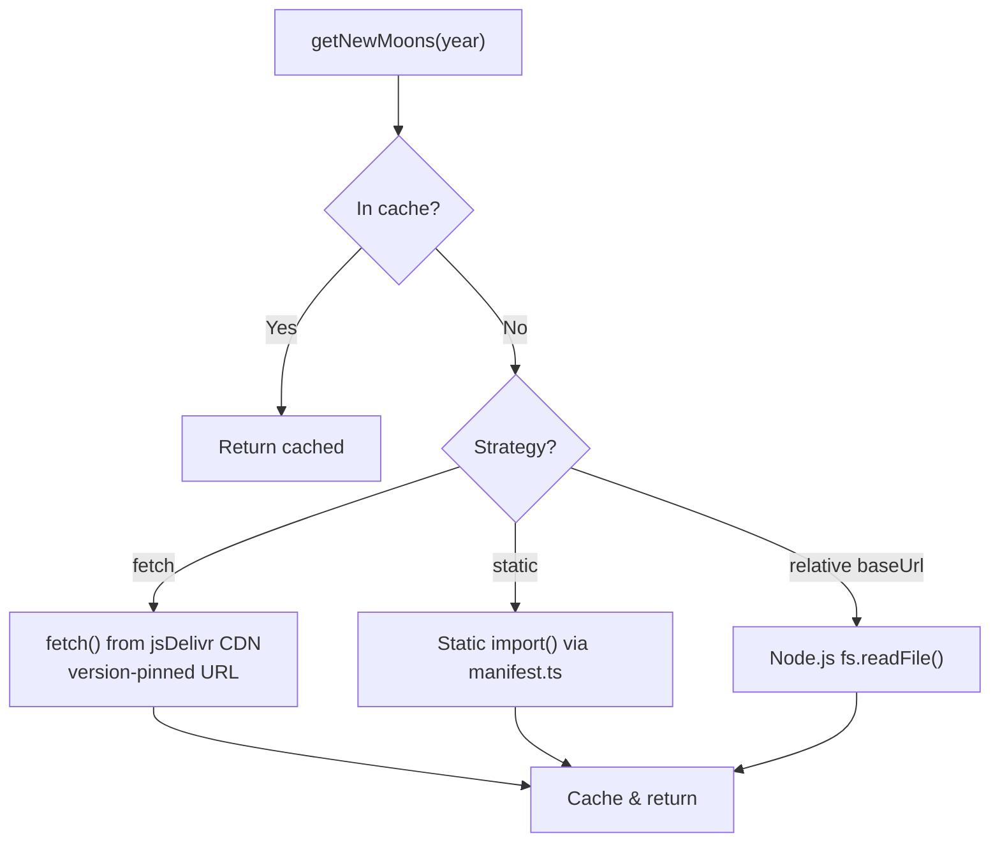

Configuration:

```typescript
import { configure } from 'lunisolar-ts';

// Default: version-pinned CDN fetch
configure({ strategy: 'fetch' });

// Bundler-friendly static imports
configure({ strategy: 'static' });

// Custom CDN or self-hosted endpoint
configure({ strategy: 'fetch', data: { baseUrl: 'https://my-cdn.com/data' } });
```

### Core Calendar Conversion (`pkg/src/core/LunisolarCalendar.ts`)

The TypeScript implementation mirrors the Python engine's service architecture:

```typescript
// Public API
const cal = await LunisolarCalendar.fromSolarDate(new Date('2025-02-15'), 'Asia/Shanghai');
cal.lunarYear;   // 2025
cal.lunarMonth;  // 1
cal.lunarDay;    // 18
cal.yearStem;    // '乙'
cal.yearBranch;  // '巳'
cal.dayStem;     // '壬'
cal.dayBranch;   // '辰'
```

Internally it:

1. Loads new moon timestamps and solar terms for the relevant years via `DataLoader`.
2. Builds `MonthPeriod` objects from consecutive new moon pairs.
3. Maps principal solar terms to months using CST date-only boundaries.
4. Applies the no-zhongqi leap month rule.
5. Computes sexagenary (Gan-Zhi) cycles for year, month, day, and hour.

### Build & Distribution

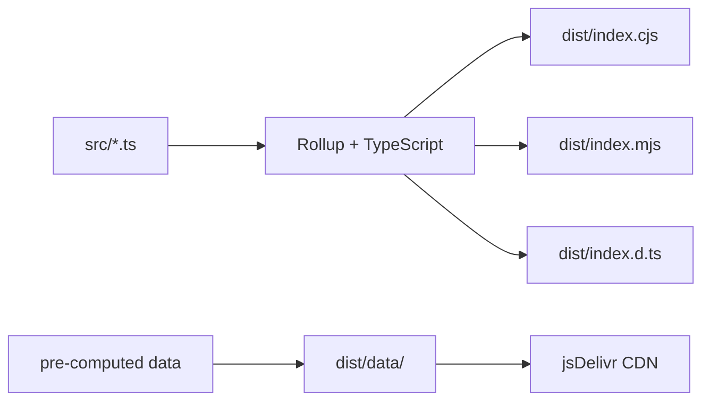

The package ships as dual CJS/ESM with zero runtime dependencies (only `tslib`). Pre-computed JSON data files are served from jsDelivr CDN by default.

---

## Data Flow: End to End

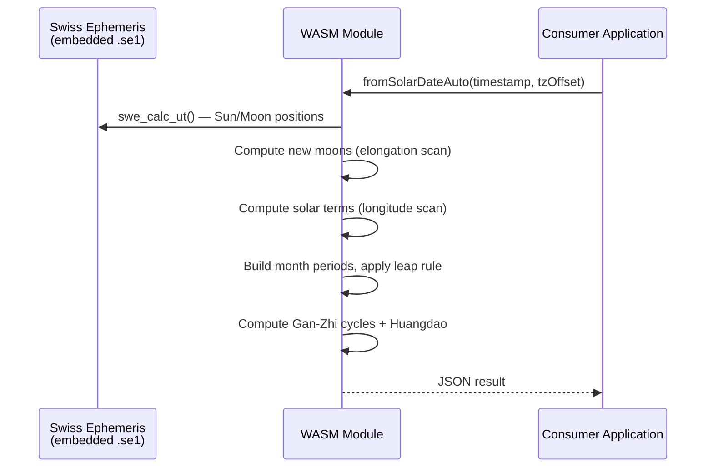

For the archived TypeScript path (requires pre-computed data):

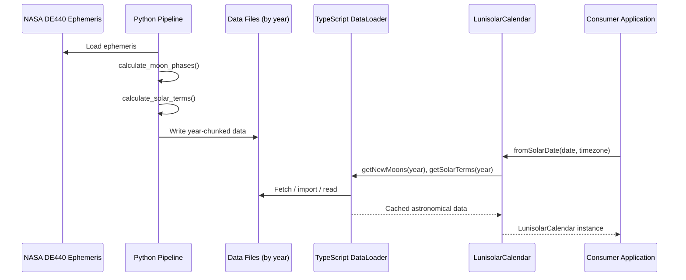

---

## Directory Layout

```
lunisolar-ts/
├── ports/                      # All language ports
│   ├── lunisolar-ts/           # TypeScript npm package (lunisolar-ts)
│   ├── lunisolar-rs/           # Rust wasm-pack port (standalone with SE)
│   │   ├── Cargo.toml          # Depends on swisseph-wasm
│   │   └── src/
│   │       ├── lib.rs          # Calendar logic + fromSolarDateAuto()
│   │       └── ephemeris.rs    # SE-based new moon / solar term computation
│   ├── lunisolar-emcc/         # Emscripten C source (builds to pkg/)
│   │   ├── build.sh            # Compiles C + SE + embeds .se1 data
│   │   ├── lunisolar.c         # Calendar logic + from_solar_date_auto()
│   │   ├── ephemeris.c         # SE-based new moon / solar term computation
│   │   └── ephemeris.h
│   └── swisseph-rs/            # Swiss Ephemeris Rust + wasm-bindgen bindings
│       ├── Cargo.toml
│       ├── build.rs            # Compiles SE C source via cc crate
│       ├── ephe/               # Embedded .se1 ephemeris data files
│       └── src/
│           ├── lib.rs          # WASM exports + C stdlib shims + in-memory FS
│           └── bindings.rs     # FFI bindings to SE C functions
├── lunisolar-python/           # Python data pipeline
│   ├── config.py               # Shared constants (ephemeris path, physics, location)
│   ├── utils.py                # Logging, CSV/JSON I/O, argument parsing
│   ├── timezone_handler.py     # IANA timezone conversions (pytz)
│   ├── main.py                 # Orchestrator — parallel task runner
│   ├── moon_phases.py          # New/Full Moon calculator
│   ├── solar_terms.py          # 24 solar terms calculator
│   ├── moon_illumination.py    # Moon illumination percentage
│   ├── celestial_events.py     # Rise/set/transit events
│   ├── antitransit.py          # Antitransit helper
│   ├── tidal_data.py           # Tidal acceleration & lunar mansions
│   ├── lunisolar_v2.py         # Core lunisolar calendar engine (9 services)
│   └── huangdao_systems_v2.py  # Auspicious day systems
├── pkg/                        # Main npm package (lunisolar-wasm, Emscripten)
│   ├── package.json            # npm package metadata
│   └── README.md               # Package documentation
├── vendor/                     # Shared third-party source code
│   └── swisseph/               # Swiss Ephemeris C source (v2.10.03)
├── tests/                      # Integration tests
│   ├── lunisolar-wasm/         # Accuracy & benchmark tests
│   └── swisseph-wasm/          # Swiss Ephemeris accuracy & benchmark tests
├── docs/                       # Detailed documentation
├── nasa/                       # JPL ephemeris data files
│   └── de440.bsp
├── output/                     # Generated data (git-ignored)
└── requirements.txt            # Python dependencies
```
